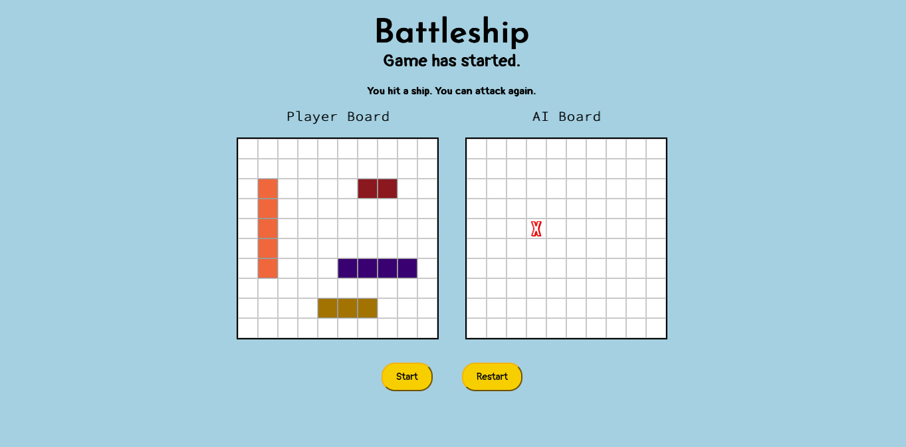

# Battleship-Game
    The Battleship Game that was made is played with a single player that will play against a built-in AI. The player will first drag their ships onto their board, positioning them in any way they would want to. After doing so, the player can start the game and randomly generated ships of the same sizes will be randomly placed on the AI Board as well (with its visibility hidden). The player will now be able to attack first, clicking on any square of the AI Board that they think a ship might be placed. If the player successfully hit a ship, they can go again. However, if they miss, the AI will then have a go at randomly hitting any square on the player's board. If the AI successfully hits a ship, they will go again. If they miss, the player is able to have another turn at hitting the AI's ship. This game will continue until all ships have been sunk, either on the AI's board or the player's board, with a winner indicated once such an occurence happens. After the game ends, the player must restart the game if they want to play again. 

# SCREENSHOT OF THE GAME

# TECHNOLOGIES USED
    - Javascript
    - CSS
    - HTML

# GETTING STARTED
    URL Link

# NEXT STEPS
    - Include a legend (denoting what the hit and miss symbol looks like beforehand)
    - Include a ship counter (counts number of ships that are left on the board for both the AI and the player)
    - Implement beter styling (Examples: the ships can be styled using images to look like actual ships, the board can styled to look like the sea, and etc.)
    - Larger board
    - Indicate when a ship is sunk

